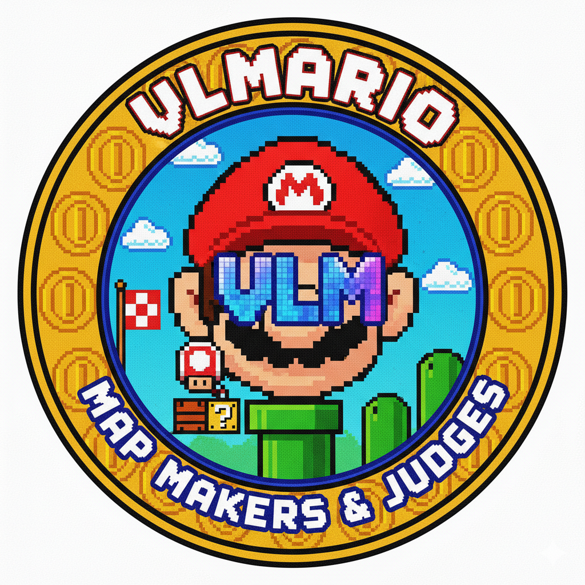
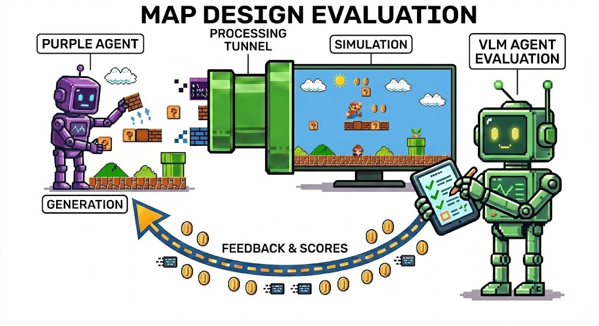

<table width="300%">
<tr>
<td width="200" align="center">

</td>
<td width="1300" align="center">

<h1>VLMario Benchmark</h1>

**A Vision-Language Model Benchmark for Mario Level Generation and Evaluation**

[Overview](#overview) • [Architecture](#architecture) • [Installation](#installation) • [Quick Start](#quick-start) • [Evaluation](#evaluation) • [ASCII Reference](#ascii-reference)

</td>
</tr>
</table>

---

## Overview

VLMario is an open benchmark framework for evaluating the ability of AI agents to generate playable Super Mario Bros. style levels. This benchmark leverages Vision-Language Models (VLMs) to evaluate generated levels based on gameplay simulation videos.

### Key Features

- **Automated Evaluation Pipeline**: Map Generation → Gameplay Simulation → Evaluation with VLM
- **Multi-dimensional Scoring**: 8 evaluation criteria (Composition, Probability, Completeness, Aesthetics, Originality, Fairness, Fun, Difficulty)
- **Average Aggregation**: Evaluates 25 maps and calculates the final score by averaging the scores across all maps

## Architecture

<p align="center">
  
</p>

The VLMario benchmark consists of two main components:

1. **Map Designer (Purple Agent)**: Generates ASCII-based Mario levels
2. **Map Evaluator (Green Agent)**: Orchestrates evaluation and performs the following tasks:
   - Requests maps from the designer
   - Executes A* simulation using [Mario-AI-Framework](https://github.com/shyamsn97/Mario-AI-Framework)
   - Records gameplay videos
   - Evaluates maps based on videos using Gemini VLM
   - Aggregates scores from multiple maps

## Installation

### Prerequisites

- **Docker** (Required)
- **Google API Key** (For Gemini models)

### Step 1: Clone the Repository

```bash
git clone https://github.com/GIST-CILab/agentx-vlmario.git
cd agentx-vlmario
```

### Step 2: Build the Image

Build the benchmark execution environment using Docker. It automatically includes Java, ffmpeg, and necessary Python packages.

```bash
docker build -t vlmario .
```

### Step 3: Configure Environment Variables

Create a `.env` file in the root directory and add the following:

```env
# Required Settings
GOOGLE_GENAI_USE_VERTEXAI=FALSE
GOOGLE_API_KEY=your_google_api_key_here

# Optional Settings
# OpenRouter Configuration
USE_OPEN_ROUTER=FALSE   # Change Map Evaluator's model to OpenRouter
OPEN_ROUTER_API_KEY=your_openrouter_api_key_here

# Evaluator (Green Agent) Configuration
# Control creativity of the evaluation model (Default: 0.0)
TEMPERATURE=0.0
```

### Step 4: Run

To check the generated maps, videos, and evaluation results on your local machine, use the **Volume Mount** option. This allows you to check code changes in real-time without rebuilding the image:

```bash
# For Windows PowerShell
docker run -it --env-file .env -v ${PWD}:/app -v /app/.venv vlmario

# For macOS/Linux
docker run -it --env-file .env -v $(pwd):/app -v /app/.venv vlmario

# Additional Options
--show-logs: Show logs during evaluation
```

Running this command will automatically perform the following:
1. Start Map Evaluator (Green Agent)
2. Start Map Designer (Purple Agent)
3. Request 25 maps from the designer
4. Evaluate each map using gameplay simulation
5. Save all results (maps, videos, JSON) to the `outputs/` folder
6. Report final scores based on the average across all maps.

## Evaluation

### Scoring System

Maps are evaluated on a scale of 1-20 based on 8 criteria, each scored on a 7-point Likert scale:

| Criterion | Description |
|-----------|-------------|
| **Composition** | Whether essential Super Mario Bros components (start, goal, platforms, enemies) exist |
| **Probability** | Whether placements follow the logical constraints of the original Super Mario Bros |
| **Completeness** | Whether components influence strategic decision-making |
| **Aesthetics** | Visual balance and overall aesthetic appeal |
| **Originality** | Presence of unique or uncommon structural ideas |
| **Fairness** | Avoidance of unfair, sudden, or unpredictable hazards |
| **Fun** | Whether the level appears enjoyable to play |
| **Difficulty** | Overall perceived difficulty |
|||
| **Total Score** | Score judged by Gemini considering all items comprehensively |

### Aggregation Method

- **Total Maps Evaluated**: 25
- **Aggregation Method for Final Score**: Average across all evaluated maps
- **Final Score**: Mean score over all 25 maps

This approach rewards consistency while allowing for experimental variations.

### Failure Handling & Penalties

If a normal evaluation cannot be performed, the attempt is recorded with a **minimum score (1 point)** to accurately reflect the agent's reliability:

- **Communication Failure & Timeout**: When the agent does not respond or the request is interrupted.
- **Extraction Failure**: When an ASCII map cannot be found or parsed from the agent's response.
- **Simulation Failure**: When the generated map is unplayable and no gameplay video is created.
- **Evaluation Error**: When results cannot be obtained due to LLM service issues. (Upon 5 consecutive failures)

*In these cases, the total score and all sub-category scores (composition, etc.) are set to 1, and the reason is documented in the result JSON.*

### Configuration

Modify evaluation parameters in `scenarios/mario/scenario.toml`:

```toml
[config]
num_maps = 25                    # Total maps to evaluate
jar_output_dir = "./"            # Gameplay video directory
```

### Output

After evaluation, all artifacts are saved to the `outputs/` directory. All files within a single session share the same timestamp for easy tracking:

- **ASCII Maps**: `YYYYMMDD_HHMMSS_{idx}_map.txt`
- **Gameplay Videos**: `YYYYMMDD_HHMMSS_{idx}_video.mp4`
- **Individual Results**: `YYYYMMDD_HHMMSS_{idx}_result.json`
- **Aggregated Summary**: `YYYYMMDD_HHMMSS_total_result.json`

## ASCII Reference

### Map Format Requirements

- **Row Consistency**: All rows must be the same length (padded with `-`)
- **Required Elements**: `M` (start) and `F` (exit)
- **Playability**: Level should be completable within 60 seconds

### ASCII Tile Guide

#### Level Boundaries
| Character | Description |
|-----------|-------------|
| `M` | Mario Start Position |
| `F` | Mario Exit (Flag) |
| `-` or space | Empty space (air) |

#### Terrain & Blocks
| Character | Description |
|-----------|-------------|
| `X` | Ground (solid floor) |
| `#` | Pyramid Block (stairs/decorative) |
| `S` | Normal Brick (breakable) |
| `C` | Coin Brick |
| `L` | 1-Up Brick |
| `U` | Mushroom Brick |
| `D` | Used Block (already hit) |
| `%` | Platform (jump-through) |
| `\|` | Platform Background |

#### Question Blocks
| Character | Description |
|-----------|-------------|
| `?` or `@` | Mushroom Question Block |
| `Q` or `!` | Coin Question Block |
| `1` | Invisible 1-Up Block |
| `2` | Invisible Coin Block |

#### Items
| Character | Description |
|-----------|-------------|
| `o` | Collectible Coin |

#### Pipes
| Character | Description |
|-----------|-------------|
| `t` | Empty Pipe |
| `T` | Flower Pipe (with Piranha Plant) |
| `<` `>` | Pipe Top (left/right) |
| `[` `]` | Pipe Body (left/right) |

#### Bullet Bill Cannons
| Character | Description |
|-----------|-------------|
| `*` | Bullet Bill Cannon |
| `B` | Bullet Bill Head |
| `b` | Bullet Bill Body |

#### Enemies
| Character | Description |
|-----------|-------------|
| `E` or `g` | Goomba |
| `G` | Winged Goomba |
| `k` | Green Koopa |
| `K` | Winged Green Koopa |
| `r` | Red Koopa |
| `R` | Winged Red Koopa |
| `y` | Spiny |
| `Y` | Winged Spiny |

### Example Map

```ascii
----------------------------------------------------------------------------------------------------
----------------------------------------------Q---Q---Q---------------------------------------------
----------------------------------------------------------------------------------------------------
--------------------------E--------------------------------------------E----------------------------
XXXXXXXXXXXX----------XXXXXXXX--------<>--------XXXXXXXXX--------<>-----------XXXXXXXXX----F--------
XXXXXXXXXXXX----------XXXXXXXX--------[]--------XXXXXXXXX--------[]-----------XXXXXXXXX---XXX-------
XXXXXXXXXXXX----------XXXXXXXX--------[]--------XXXXXXXXX--------[]-----------XXXXXXXXX--XXXXX------
M-XXXXXXXXXX----------XXXXXXXX-------XXXX-------XXXXXXXXX-------XXXX----------XXXXXXXXX-XXXXXXX-----
XXXXXXXXXXXXXXXXXXXXXXXXXXXXXXXXXXXXXXXXXXXXXXXXXXXXXXXXXXXXXXXXXXXXXXXXXXXXXXXXXXXXXXXXXXXXXXXXXXXX
```

Refer to `scenarios/mario/prompts/map_ascii_guide.md` for the complete ASCII guide.

## Project Structure

```
agentx-vlmario/
├── scenarios/
│   └── mario/
│       ├── scenario.toml             # Benchmark configuration
│       ├── mario_map_evaluator.py    # Green agent (Evaluator)
│       ├── mario_map_designer.py     # Purple agent (LLM Designer)
│       ├── PlayAstar.jar             # Gameplay simulator
│       ├── prompts/                  # Prompt templates
│       │   ├── system_prompt.md
│       │   ├── map_ascii_guide.md
│       │   ├── map_request.md
│       │   └── initial_criterion_prompt.md
│       └── img/                      # Game assets for simulation
├── src/
│   └── agentbeats/                   # Core framework
└── .env                              # Environment configuration file
```

## Acknowledgments

- Built on the [AgentBeats](https://github.com/rdi-foundation/agentbeats-tutorial) framework
- Mario A* simulation powered by [Mario-AI-Framework](https://github.com/shyamsn97/Mario-AI-Framework)
- Powered by Google Gemini for vision-language evaluation
